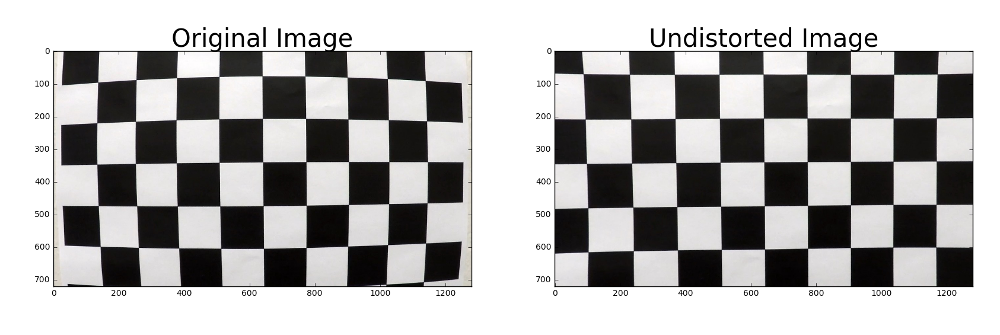

## Advanced Lane Finding Project

In this project, your goal is to write a software pipeline to identify the lane boundaries in a video, but the main output or product we want you to create is a detailed writeup of the project.

<div  align="center">    

</div>

---

### Introduction
The goals / steps of this project are the following:

* Compute the camera calibration matrix and distortion coefficients given a set of chessboard images.
* Apply a distortion correction to raw images.
* Use color transforms, gradients, etc., to create a thresholded binary image.
* Apply a perspective transform to rectify binary image ("birds-eye view").
* Detect lane pixels and fit to find the lane boundary.
* Determine the curvature of the lane and vehicle position with respect to center.
* Warp the detected lane boundaries back onto the original image.
* Output visual display of the lane boundaries and numerical estimation of lane curvature and vehicle position.


### Camera Calibration

#### 1. Briefly state how you computed the camera matrix and distortion coefficients. Provide an example of a distortion corrected calibration image.

In this step, We mainly use several functions.
- `cv2.findChessboardCorners()`: used to get `imgpoints`
- `cv2.drawChessboardCorners()`: used to visualize result
- `cv2.calibrateCamera()`: used to get `mtx`(camera matrix) and `dist`(distortion coefficients)
- `cv2.undistort(img, mtx, dist, None, mtx)`: used to undistort a test image   

The code for this step is contained in the cell (`In [2] & In [3]`) of the IPython notebook located in "Advanced-Lane-Lines.ipynb". The result is as follows:

<div  align="center">    

</div>

### Pipeline (single images)

#### 1. Correcting for Distortion.

- Step 1: Load the data of camera matrix and distortion coefficients has been saved locally.
```
with open( "./output_images/wide_dist_pickle.p", "rb" ) as f:
    data = pickle.load(f)   
mtx = data['mtx']
dist = data['dist']
```
- Step 2: Undistorting a test image.
```
img_path_list = glob.glob("./test_images/*.jpg")
image = mpimg.imread(img_path_list[2])
undist_img = undistort(image, mtx, dist)
```
The result is as follows:
<div  align="center">    

</div>

#### 2. Perspective transform.

The code for my perspective transform includes a function called `perspective_Transform(image, src = None, dst = None)`, which appears in the cell (`In [7]`) of the IPython notebook located in "Advanced-Lane-Lines.ipynb".  The `warper()` function takes as inputs an image (`img`), as well as source (`src`) and destination (`dst`) points.  I chose the hardcode the source and destination points in the following manner:

```python
    img_size = (image.shape[1], image.shape[0])
    corners = np.float32([[190,720],[589,457],[698,457],[1145,720]])

    new_top_left=np.array([corners[0,0],0])
    new_top_right=np.array([corners[3,0],0])
    offset=[150,0]
    dst = np.float32([corners[0]+offset,new_top_left+offset,new_top_right-offset ,corners[3]-offset])   
    src = np.float32([corners[0],corners[1],corners[2],corners[3]])
```
This resulted in the following source and destination points:

| Source        | Destination   | 
|:-------------:|:-------------:| 
| 190, 720      | 340, 720      | 
| 589, 457      | 340, 0        |
| 698, 457      | 995, 0        |
| 1145, 720     | 995, 720      |

I verified that my perspective transform was working as expected by drawing the `src` and `dst` points onto a test image and its warped counterpart to verify that the lines appear parallel in the warped image.

<div  align="center">    

</div>

#### 3. Thresholded binary image. 

- Step 1: Implement the basic method

    - **Abs_sobel**:`abs_sobel_thresh(image, orient='x', sobel_kernel=3, thresh=(0, 255))`
    
    - **Magnitude of the Gradient**:`mag_thresh(image, sobel_kernel=3, mag_thresh=(0,255))`  
    - **Direction of the Gradient**:`dir_threshold(image, sobel_kernel=3, thresh=(0., np.pi/2))`  
    - **HLS Color Thresholding**`def hls_select(image, channel='h',thresh=(0, 255))`

- Step 2: Combining Thresholds   
I used `S` `L` color thresholds and gradient thresholds of `x` to generate a binary image. The corresponding code is `gradient_Threshold(img,thresh_dic)`.

- Step 3: Morphological Transformations
In order to reduce noise pixels, I used [cv2.erode()](https://docs.opencv.org/3.0-beta/doc/py_tutorials/py_imgproc/py_morphological_ops/py_morphological_ops.html)
to process binary image.

Here's an example of my output for this step.  (note: this is not actually from one of the test images)
<div  align="center">    

</div>

#### 4. Describe how (and identify where in your code) you identified lane-line pixels and fit their positions with a polynomial?

Then I did some other stuff and fit my lane lines with a 2nd order polynomial kinda like this:

![alt text][image5]

#### 5. Describe how (and identify where in your code) you calculated the radius of curvature of the lane and the position of the vehicle with respect to center.

I did this in lines # through # in my code in `my_other_file.py`

#### 6. Provide an example image of your result plotted back down onto the road such that the lane area is identified clearly.

I implemented this step in lines # through # in my code in `yet_another_file.py` in the function `map_lane()`.  Here is an example of my result on a test image:

![alt text][image6]

---

### Pipeline (video)

#### 1. Provide a link to your final video output.  Your pipeline should perform reasonably well on the entire project video (wobbly lines are ok but no catastrophic failures that would cause the car to drive off the road!).

Here's a [link to my video result](./project_video.mp4)

---

### Discussion

#### 1. Briefly discuss any problems / issues you faced in your implementation of this project.  Where will your pipeline likely fail?  What could you do to make it more robust?

Here I'll talk about the approach I took, what techniques I used, what worked and why, where the pipeline might fail and how I might improve it if I were going to pursue this project further.  
